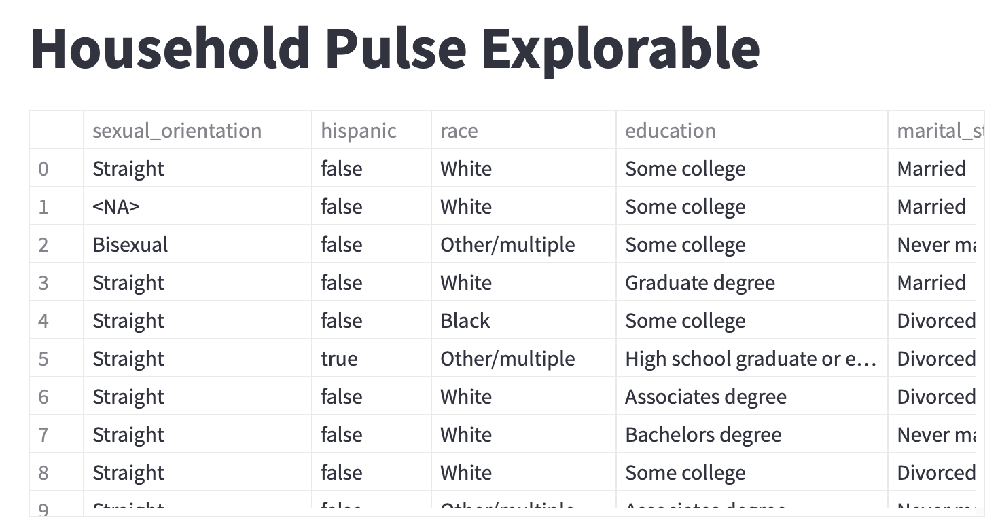
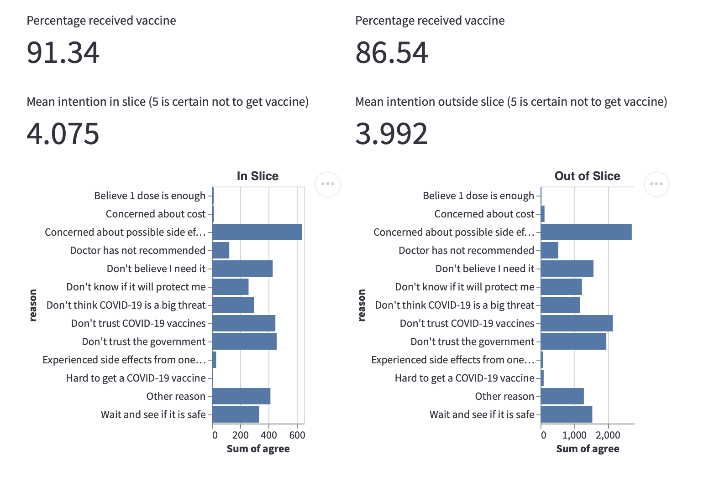

# Interactivity Lab: Household Pulse Explorable

**Goal: Build an interactive application that incorporates fundamental Streamlit components to offer a curated yet open-ended look at a dataset.**

The [Household Pulse Survey](https://www.census.gov/data/experimental-data-products/household-pulse-survey.html) is a weekly survey run by the US Census Bureau that measures how the coronavirus pandemic is impacting households across the country from a social and economic perspective. It’s a valuable and extensive source of data to gain insight on individuals and families, and one that we will only begin to touch on in today’s lab.

To help a user explore this data interactively, we will build a Streamlit application that displays the results of one Household Pulse Survey, which ran from from September 29 to October 11, 2021.

# Part 0: Setup (before class)

Before coming to class, please download this repository, set up your virtual environment of choice, and install the dependencies using `pip install -r requirements.txt`. Now start the application by typing `streamlit run streamlit_app.py`. You should see the template code running in the browser!

# Part 1: Warmup and generating plots

All your code for this lab should go in the `streamlit_app.py` script. In this file, you’ll see helper functions (some of which you will fill in) and a section labeled “MAIN CODE.” Most of your code will go in this latter section, which is at the top level of the script and will run from top to bottom to render your Streamlit application.

1. Let’s get started by printing some data to the browser. **Implement the `load_data` function, which should read the CSV file `pulse39.csv` and return it.** Then, in the main code, use Streamlit’s builtin dataframe component to print the first 10 rows of `df`. You should see a scrollable table like this:



To get an idea of the distribution of demographics in this dataset, let’s create some summary plots using Altair. (The dataset includes several demographic features, which are listed in the Appendix at the bottom of this document. You may wish to visualize more of these features if you have time.)

1. **Create Altair bar charts to visualize the distributions of race and education levels in the data.** You may want to refer to the [Altair documentation](https://altair-viz.github.io/user_guide/data.html) as you build your charts. Remember that to render an Altair chart in Streamlit, you must call `st.altair_chart(chart)` on the Altair chart object.

   _Tip:_ To get the counts of a categorical variable to visualize, you can use the Altair `count` aggregation, like so:

   ```python
   chart = alt.Chart(df)...encode(
       x='count()',
       y='<field of interest>'
   )
   ```

2. **Make your charts interactive!** This is super easy with Altair. Just add `.interactive()` to the end of your Altair function call, and you should be able to pan and zoom around your chart. You should also create some tooltips to show the numerical data values. To do this, add the `tooltip` parameter to your encoding, like so:

   ```python
   chart = alt.Chart(df)...encode(
       ...,
       tooltip=['<field of interest>']
   ).interactive()
   ```

Examine the summary charts and see if you can get a sense of the distributions in the dataset. Take a minute to discuss with your group: Who is well-represented in this data, and who isn’t? Why might this be the case?

# Part 2: Interactive Slicing Tool

Up until now, we’ve only used basic interactivity from Altair. But what if we want to allow the user to choose which data gets plotted? Let’s now build a Streamlit interface that lets the user select a group of interest based on some demographic variables (which we’ll call a “slice”), and compare distributions of outcome variables for people within the slice against people outside of it.

We'll allow the user to slice the data based on the following four **demographic variables** (don't worry, the code will be similar for most of these):

- `gender` (includes transgender and an option for other gender identities)
- `race`
- `education` (highest education level completed)
- `age` (integers ranging from 19 to 89)

Once they've sliced the data, we will visualize a set of vaccination-related **outcome variables** for people inside and outside the slice:

- `received_vaccine` (boolean)
- `vaccine_intention` (scale from 1 - 5, where 1 is most likely to get the vaccine and 5 is most likely NOT to get the vaccine)
- `why_no_vaccine_<reason>` (thirteen boolean columns indicating whether the person does not want to get the vaccine for each reason. Note that multiple reasons can be selected)

If you're interested, the dataset contains a few other sets of outcomes, which you can browse in the Appendix. But for now, let's start slicing!

1. **Decide what controls are best for the user to manipulate each demographic variable.** The controls that are supported in Streamlit are listed [here](https://docs.streamlit.io/library/api-reference/widgets).
2. **Build the controls in the “Custom slicing” section of the page.** If you run into trouble, refer to the [Streamlit docs](https://docs.streamlit.io/library/api-reference/widgets) or ask the TAs! _Tip:_ Take note of how the values are returned from each Streamlit control. You will need this information for the subsequent steps.
3. **Fill in the `get_slice_membership` function**, which builds a Boolean series indicating whether each data point is part of the slice or not. An example of how to do this using gender as a multiselect has already been filled in for you.
4. **Now, use the values returned from each control to create a slice** by calling the `get_slice_membership` function.
5. **Test that your slicing tool is working** by writing a line to the page that prints the count and percentage of the data that is contained in the slice. Manipulate some of the controls and check that the size of each slice matches your expectations.
6. **Create visualizations comparing the three outcome variables within the slice to the variables outside the slice.** We recommend using an `st.metric` component to show the vaccination rate and the vaccine intention fields, and a bar chart to show the distribution of reasons for not getting the vaccine.

   _Tip:_ To display the vaccine hesitancy reasons, the dataframe will require some transformation before passing it to Altair. We’ve provided a utility function to help you do this, which you can use like so:

   ```python
   # Creates a dataframe with columns 'reason' (string) and 'agree' (boolean)
   vaccine_reasons_inslice = make_long_reason_dataframe(df[slice_labels], 'why_no_vaccine_')

   chart = alt.Chart(vaccine_reasons_inslice, title='In Slice').mark_bar().encode(
       x='sum(agree)',
       y='reason:O',
   ).interactive()
   # ...
   ```

Here is an example of what your slicing tool could look like (here we are using `st.columns` to make a 2-column layout):



With your group, try slicing the data a few different ways. Discuss whether you find any subgroups that have different outcomes than the rest of the population, and see if you can hypothesize why this might be!

# Part 3 (bonus): Interactive Random Sampling

If you have time, you can implement another simple interactive function that users will appreciate. While large data exploration tools are powerful ways to see overall trends, the individual stories of people in the dataset can sometimes get lost. Let’s implement a tool to randomly sample from the dataset and portray information relevant to the topic you investigated above.

1. **In the “Person sampling” section, build a button to retrieve a random person.**
2. **When the button is pressed, write code to retrieve a random row from the dataset.** You can use the `pandas.DataFrame.sample` function for this.
3. **Display the information from this datapoint in a human-readable way.** For example, one possible English description of a datapoint could look like this:

   > This person is a **65**-year-old **Straight**, **Married** **Female** of **White** race (**non-hispanic**).
   > They **have not** received the vaccine, and their intention to not get the vaccine is **3.0**.
   > Their reasons for not getting the vaccine include: **Concerned about possible side effects, Don't know if it will protect me, Don't believe I need it, Don't think COVID-19 is a big threat**

As in Part 2, feel free to communicate this information in the way that feels most appropriate to you.

Discuss with your group: What do you notice about individual stories generated this way? What are the strengths and drawbacks of sampling and browsing individual datapoints compared to looking at summary visualizations?

# Appendix: Dataset Features

## Demographic Variables

- `age` and `age_group` (`age_group` bins the ages into four categories)
- `gender` (includes transgender and an option for other gender identities)
- `sexual_orientation`
- `marital_status`
- `race` and `hispanic` (the US Census defines ‘Hispanic’ as being independent of self-identified race, which is why it is coded as a separate variable)
- `education` (highest education level completed)
- `num_children_hhld` (the number of children living in the person’s household)
- `had_covid` (boolean)

## Outcome Variables

### **Reasons for vaccine hesitancy**

To study vaccination rates, people’s intentions to get or not get the vaccine, and their reasons for this, the following columns are available:

- `received_vaccine` (boolean)
- `vaccine_intention` (scale from 1 - 5, where 1 is most likely to get the vaccine and 5 is most likely NOT to get the vaccine)
- `why_no_vaccine_<reason>` (thirteen boolean columns indicating whether the person does not want to get the vaccine for each reason. Note that multiple reasons can be selected)

### **Economic and food insecurity**

The dataset includes columns that may be useful to understand people’s levels of financial and food insecurity:

- `expenses_difficulty` (scale from 1 - 4, 1 is least difficulty, 4 is most difficulty paying expenses)
- `housing_difficulty` (scale from 1 - 4, same as above for paying next rent or mortgage payment)
- `food_difficulty` (scale from 1 - 4, same as above for having enough food)
- `why_not_enough_food_<reason>` (four boolean columns indicating whether the person experienced each reason for not having enough food. Note that multiple reasons can be selected)

### **Mental health**

The dataset also includes some columns for understanding people’s recent mental health status:

- `freq_anxiety`, `freq_worry`, `freq_little_interest`, `freq_depressed` (scale from 1 - 4 where 1 indicates not at all, 4 indicates nearly every day in the past two weeks)
- `mh_prescription_meds` (boolean whether the person has taken prescription medication for mental health)
- `mh_services` (boolean whether the person has received mental health services in the past month)
- `mh_notget` (boolean whether the person sought mental health services but did not receive them)
